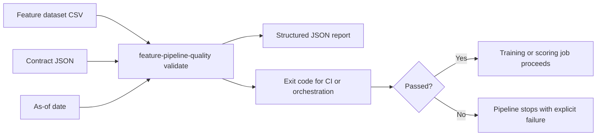

# feature-pipeline-quality

[](./pyproject.toml)
[](./pyproject.toml)
[](./examples/contract.json)
[](./LICENSE)

A small, production-style CLI for validating tabular feature datasets against a contract before training or scoring jobs run.

It checks schema presence, row count, null thresholds, type parsing, duplicate keys, and freshness, then emits a JSON report and CI-friendly exit codes.

## Validation flow



## Why this exists

Feature pipelines often fail silently until model training or scoring breaks downstream. This repo demonstrates a simple contract-check pattern that can run in scheduled jobs, CI, or orchestration tasks.

## Features

- Required column checks
- Row count minimums
- Column-level null ratio thresholds
- Type parsing checks (`str`, `int`, `float`, `bool`, `date`, `datetime`)
- Duplicate detection on composite keys
- Freshness checks on a date/datetime column
- Structured JSON output + non-zero exit code on failure

## Repository shape

- `examples/contract.json` shows the validation contract expected by the CLI.
- `examples/features_good.csv` and `examples/features_bad.csv` give passing and failing fixtures.
- `tests/test_validator.py` covers the core contract checks and exit behavior.
- `pyproject.toml` exposes the package metadata and console entry point.

## Quickstart

```bash
python -m feature_pipeline_quality validate \
  --contract examples/contract.json \
  --data examples/features_good.csv \
  --as-of 2026-02-25
```

Failing example:

```bash
python -m feature_pipeline_quality validate \
  --contract examples/contract.json \
  --data examples/features_bad.csv \
  --as-of 2026-02-25
```

Write a JSON report:

```bash
python -m feature_pipeline_quality validate \
  --contract examples/contract.json \
  --data examples/features_good.csv \
  --report /tmp/feature-quality-report.json
```

## Exit codes

- `0` = dataset passed contract checks
- `2` = one or more checks failed
- `1` = invalid input / runtime error

## Where this fits

Use this pattern ahead of model training, batch scoring, or feature publication when you want explicit data contracts instead of silent downstream breakage. It pairs naturally with policy gates such as [ml-release-gates](https://github.com/tonianev/ml-release-gates) and the broader operating patterns in [ml-platform-reference](https://github.com/tonianev/ml-platform-reference).

## Test

```bash
python -m unittest discover -s tests -v
```
